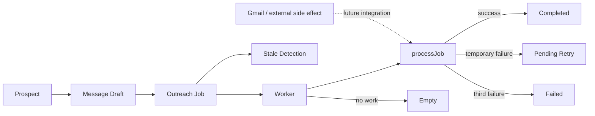
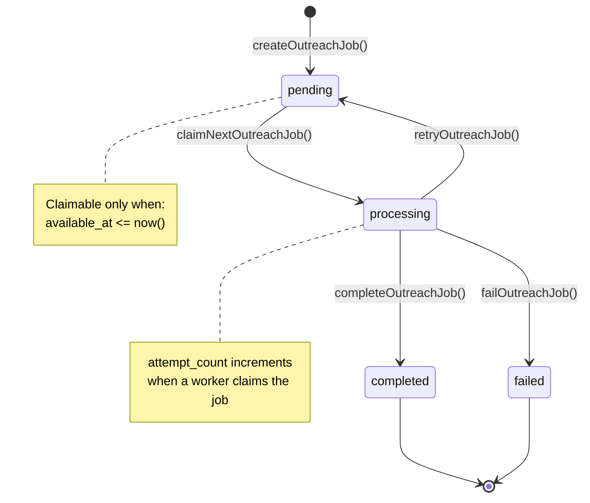
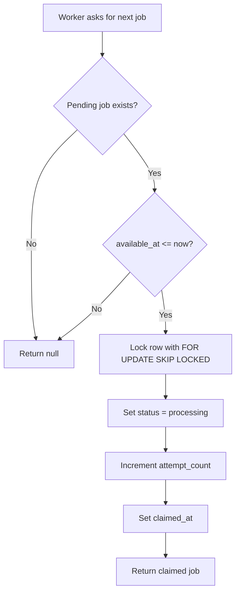
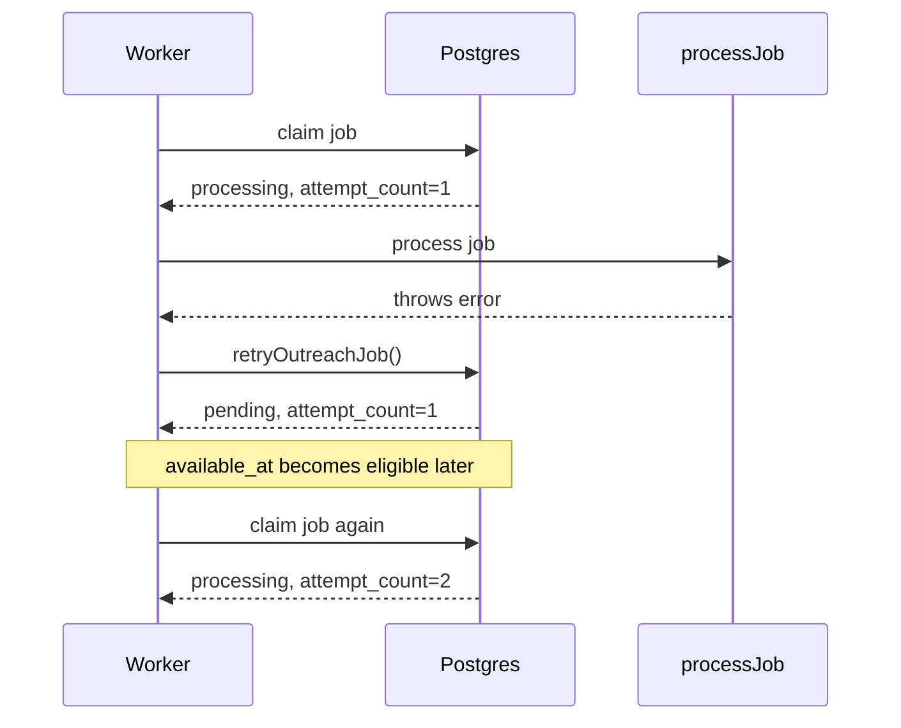
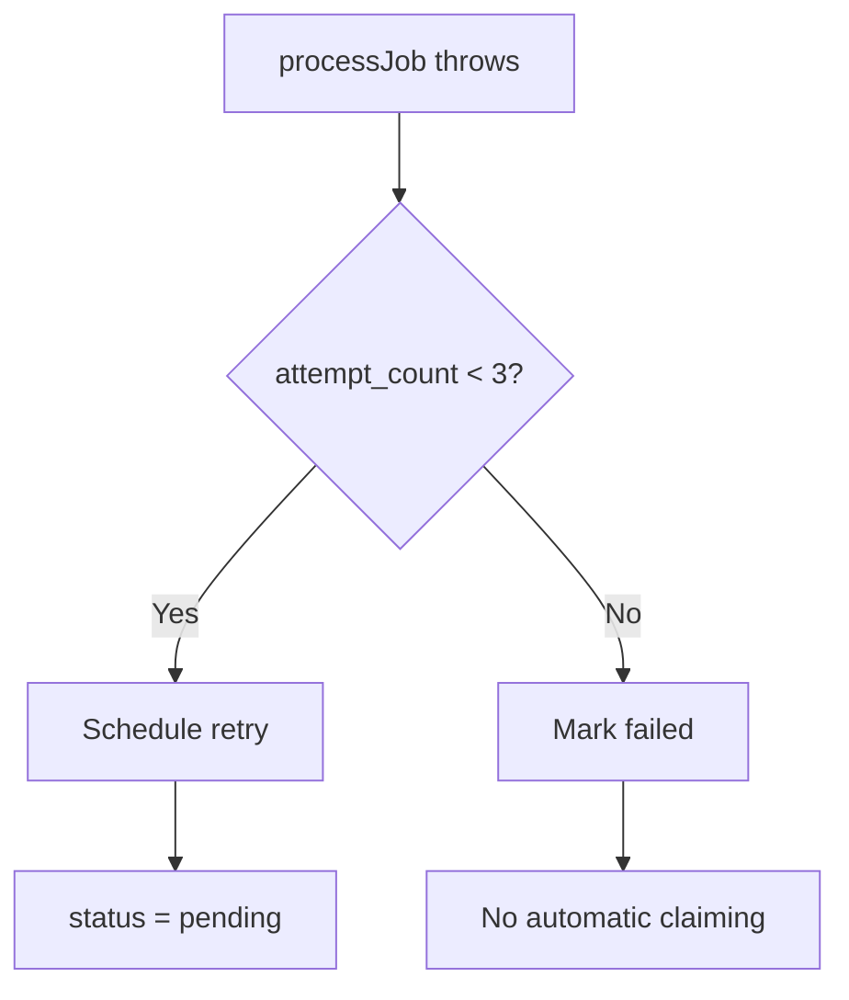
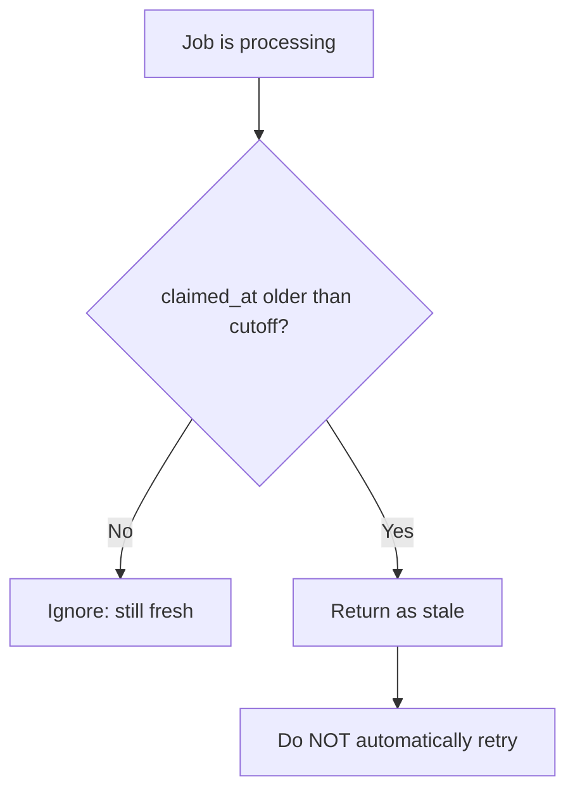
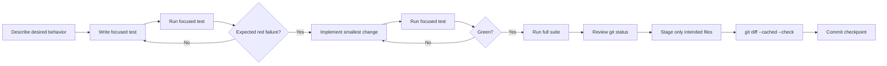

# Relay Testing & Worker Guide

**Project:** Relay
**Current test checkpoint:** 36 tests passing
**Purpose:** Explain what the tests protect, how the queue/worker system fits together, and what to do when adding new behavior.

---

## 1. Big Picture

Relay now has two major safety layers:

1. **Outreach/business rules** protect approved drafts and sending behavior.
2. **Outreach job queue + worker rules** protect background processing, retries, failures, and concurrency.



The queue/worker layer is intentionally being proven **before** Gmail is connected to it.

---

## 2. Key Terms

### Prospect

The business/customer target that Relay is working with.

### Message Draft

The outreach message associated with a prospect. Existing tests protect approval, recipient matching, Gmail draft presence, completion, and reconciliation behavior.

### Outreach Job

A durable Postgres queue record tied to a message draft.

Important fields:

- `status`
- `attempt_count`
- `available_at`
- `claimed_at`
- `last_error`

### Worker

The orchestration layer that:

1. asks Postgres for the next eligible job,
2. processes it,
3. completes it, retries it, or fails it,
4. emits structured events.

### `processJob`

A dependency injected into the worker. Right now tests use fake processors. Later this is where the real Relay outreach/Gmail processing will plug in.

---

## 3. Outreach Job State Machine



### Legal transitions

| From         | To           |           Allowed? | Function                     |
| ------------ | ------------ | -----------------: | ---------------------------- |
| `pending`    | `processing` |                Yes | `claimNextOutreachJob()`     |
| `processing` | `completed`  |                Yes | `completeOutreachJob(jobId)` |
| `processing` | `pending`    |                Yes | `retryOutreachJob(...)`      |
| `processing` | `failed`     |                Yes | `failOutreachJob(...)`       |
| `pending`    | `completed`  |                 No | Guarded                      |
| `pending`    | `failed`     |                 No | Guarded                      |
| `completed`  | `completed`  |                 No | Guarded                      |
| `failed`     | `processing` | No automatic claim | Terminal                     |

---

## 4. How Claiming Works

The queue chooses the next job. The worker does **not** pass a job ID into the claim function.

```ts
const job = await claimNextOutreachJob();
```

Conceptually:



`FOR UPDATE SKIP LOCKED` protects the queue when multiple workers race at the same time. One worker gets the row; another skips it instead of double-claiming it.

---

## 5. Retry Behavior

Relay currently treats normal processing failures as retryable until the third total attempt.

Current worker policy:

```text
Attempt 1 fails -> retry
Attempt 2 fails -> retry
Attempt 3 fails -> terminal failed
```

The worker uses:

```text
MAX_ATTEMPTS = 3
RETRY_DELAY_MS = 60,000
```

When a retry is scheduled:

```text
status       -> pending
last_error   -> error message
available_at -> future timestamp
claimed_at   -> null
attempt_count stays unchanged
```

`attempt_count` increases only when a job is actually claimed again.

Example:



---

## 6. Terminal Failure

A job becomes terminally `failed` when the worker reaches the maximum attempt count and processing fails again.



A failed job is not returned by `claimNextOutreachJob()` because the claim query only looks for `status = 'pending'`.

---

## 7. Stale Job Detection

A worker can crash after claiming a job and leave it stuck in `processing`.

Relay now detects this without automatically retrying it.



This separation is deliberate.

A stale job could mean:

```text
Safe-looking case:
worker claimed job -> crashed before doing anything

Dangerous case:
worker claimed job -> external action succeeded -> worker crashed
```

Once Gmail is connected, blindly retrying the second case could send a duplicate message.

So:

**Detect stale jobs: yes.**
**Blindly requeue stale jobs: no.**

---

## 8. Worker Flow

```mermaid
flowchart TD
    A[runOutreachWorkerOnce] --> B[claimNextOutreachJob]
    B --> C{Job found?}

    C -->|No| E[Emit empty event]
    E --> N[Return null]

    C -->|Yes| CL[Emit claimed event]
    CL --> P[processJob(job)]

    P -->|Success| CO[completeOutreachJob]
    CO --> CE[Emit completed event]
    CE --> CR[Return completed job]

    P -->|Throws| Q{attempt_count < 3?}

    Q -->|Yes| R[retryOutreachJob]
    R --> RE[Emit retry_scheduled event]
    RE --> RR[Return pending job]

    Q -->|No| F[failOutreachJob]
    F --> FE[Emit failed event]
    FE --> FR[Return failed job]
```

---

## 9. Worker Event Logging

The worker currently emits structured events instead of relying only on arbitrary `console.log()` statements.

Current event types:

```text
empty
claimed
completed
retry_scheduled
failed
```

Examples:

```ts
{
  type: "claimed",
  jobId: "...",
  attemptCount: 1
}
```

```ts
{
  type: "retry_scheduled",
  jobId: "...",
  attemptCount: 1,
  error: "Temporary processing failure",
  retryAt: ...
}
```

```ts
{
  type: "failed",
  jobId: "...",
  attemptCount: 3,
  error: "Third failure"
}
```

The worker emits state-change events **after** the corresponding database update succeeds. This prevents logging a transition that never actually happened.

---

# 10. Test Catalog

The suite currently contains **36 tests**.

## A. Existing Outreach / Gmail Safety Tests

| Test file                                   | Test                                                                                                     | What it protects                                                                       |
| ------------------------------------------- | -------------------------------------------------------------------------------------------------------- | -------------------------------------------------------------------------------------- |
| `gmail-reconciliation.test.ts`              | Gmail reconciliation: marks an uncertain Gmail send for reconciliation                                   | An uncertain send is routed to reconciliation instead of treated as confirmed success. |
| `gmail-success.test.ts`                     | Gmail success: marks the draft sent after a confirmed Gmail send                                         | A confirmed Gmail send moves the draft into its successful sent state.                 |
| `invalid-prospect-stage.test.ts`            | Invalid prospect stage: rejects an outreach draft when the prospect is not draft_ready                   | Outreach cannot proceed from an invalid prospect stage.                                |
| `outreach-already-sent.test.ts`             | Outreach already sent: rejects a draft because it was already sent                                       | Prevents repeat sending after completion.                                              |
| `outreach-claim-validation.test.ts`         | Outreach claim validation: rejects an unapproved outreach draft                                          | Only an approved draft can be claimed for outreach.                                    |
| `outreach-completion-guard.test.ts`         | Outreach completion guard: rejects completion when the draft is still pending                            | Prevents skipping the required send/processing state.                                  |
| `outreach-concurrent-claim.test.ts`         | Outreach concurrent claim: allows only one worker to claim the same draft concurrently                   | Prevents two callers from claiming the same outreach draft.                            |
| `outreach-duplicate-completion.test.ts`     | Outreach duplicate completion: rejects duplicate completion after the draft is already sent              | Prevents a completed send from being completed again.                                  |
| `outreach-duplicate-reconciliation.test.ts` | Outreach duplicate reconciliation: rejects duplicate reconciliation without mutating the original record | Prevents duplicate reconciliation operations.                                          |
| `outreach-missing-gmail-draft.test.ts`      | Outreach missing Gmail draft: rejects an outreach draft without a Gmail draft ID                         | Prevents sending when Gmail draft identity is missing.                                 |
| `outreach-recipient-mismatch.test.ts`       | Outreach recipient mismatch: rejects an outreach draft with a mismatched recipient                       | Prevents sending to an unexpected recipient.                                           |
| `outreach-reconciliation-guard.test.ts`     | Outreach reconciliation guard: rejects reconciliation when the draft is still pending                    | Reconciliation cannot be applied from the wrong state.                                 |
| `outreach-wrong-prospect.test.ts`           | Outreach wrong prospect: rejects an outreach draft when it belongs to a different prospect               | Prevents cross-prospect draft misuse.                                                  |

## B. Outreach Job Queue Tests

| Test file                                   | Test                                                                                    | What it protects                                                   |
| ------------------------------------------- | --------------------------------------------------------------------------------------- | ------------------------------------------------------------------ |
| `outreach-job-creation.test.ts`             | Outreach job creation: creates a pending outreach job for a draft                       | New jobs start correctly in `pending`.                             |
| `outreach-job-claim.test.ts`                | Outreach job claim: claims the next pending outreach job                                | An eligible pending job becomes `processing`.                      |
| `outreach-job-empty-claim.test.ts`          | Outreach job empty claim: returns null when no pending job is available                 | Empty queues are handled normally.                                 |
| `outreach-job-concurrent-claim.test.ts`     | Outreach job concurrent claim: allows only one worker to claim a pending job            | Prevents queue double-claiming.                                    |
| `outreach-job-completion.test.ts`           | Outreach job completion: marks a processing job completed                               | Valid `processing -> completed` transition works.                  |
| `outreach-job-completion-guard.test.ts`     | Outreach job completion guard: rejects completion when the job is still pending         | Prevents `pending -> completed`.                                   |
| `outreach-job-duplicate-completion.test.ts` | Outreach job duplicate completion: rejects completion when the job is already completed | Prevents repeated completion.                                      |
| `outreach-job-retry.test.ts`                | Outreach job retry: returns a processing job to pending for a later attempt             | Retry state is stored correctly.                                   |
| `outreach-job-retry-delay.test.ts`          | Outreach job retry delay: does not claim a retry before it is available                 | Future `available_at` actually delays claiming.                    |
| `outreach-job-retry-claim.test.ts`          | Outreach job retry claim: claims an eligible retry as a second attempt                  | Eligible retries return to processing and increment attempt count. |
| `outreach-job-failure.test.ts`              | Outreach job failure: marks a processing job failed                                     | Valid terminal failure works.                                      |
| `outreach-job-failure-guard.test.ts`        | Outreach job failure guard: rejects failure when the job is still pending               | Prevents `pending -> failed`.                                      |
| `outreach-job-failed-claim.test.ts`         | Outreach job failed claim: does not claim a terminally failed job                       | Failed jobs stay out of the queue.                                 |
| `outreach-job-stale-detection.test.ts`      | Outreach job stale detection: finds a processing job claimed before the cutoff          | Old abandoned processing jobs can be detected.                     |
| `outreach-job-fresh-detection.test.ts`      | Outreach job stale detection: ignores a recently claimed processing job                 | Fresh processing work is not falsely labeled stale.                |

## C. Worker Behavior Tests

| Test file                         | Test                                                                      | What it protects                                         |
| --------------------------------- | ------------------------------------------------------------------------- | -------------------------------------------------------- |
| `outreach-worker-success.test.ts` | Outreach worker success: processes and completes the next job             | Worker coordinates claim -> processing -> completion.    |
| `outreach-worker-empty.test.ts`   | Outreach worker empty queue: returns null without processing a job        | Worker safely handles no work.                           |
| `outreach-worker-retry.test.ts`   | Outreach worker retry: schedules a failed first attempt for retry         | Ordinary early failures go back to pending with a delay. |
| `outreach-worker-failure.test.ts` | Outreach worker failure: marks the third failed attempt terminally failed | Worker stops retrying after max attempts.                |

## D. Worker Logging Tests

| Test file                                 | Test                                                                           | What it protects                                 |
| ----------------------------------------- | ------------------------------------------------------------------------------ | ------------------------------------------------ |
| `outreach-worker-logging.test.ts`         | Outreach worker logging: records claim and completion events                   | Successful runs emit `claimed` and `completed`.  |
| `outreach-worker-retry-logging.test.ts`   | Outreach worker logging: records a scheduled retry after processing fails      | Retry runs emit `claimed` and `retry_scheduled`. |
| `outreach-worker-failure-logging.test.ts` | Outreach worker logging: records a terminal failure after the final attempt    | Terminal failure emits `claimed` and `failed`.   |
| `outreach-worker-empty-logging.test.ts`   | Outreach worker logging: records an empty queue event when no job is available | Empty worker runs are visible.                   |

---

# 11. Why There Are Two Different "Claim" Test Groups

This is easy to confuse.

## Outreach draft claim

Examples:

- `outreach-claim-validation.test.ts`
- `outreach-concurrent-claim.test.ts`

These protect the **business/send layer** around a message draft.

## Outreach job claim

Examples:

- `outreach-job-claim.test.ts`
- `outreach-job-concurrent-claim.test.ts`

These protect the **background queue layer**.

Think of it this way:

```text
Message Draft
    |
    | business/send safety
    v
Outreach Job
    |
    | queue/worker safety
    v
Worker
```

They solve related but different concurrency problems.

---

# 12. How to Interpret Negative Tests

A negative test can pass even though an application operation fails.

Example:

```ts
await assert.rejects(
  () => completeOutreachJob(job.id),
  /Outreach job is not processing/,
);
```

Meaning:

```text
Illegal application action: rejected
Test expectation: satisfied
Test result: PASS
```

So:

```text
application action failed = sometimes correct
test failed = test expectation was not met
```

Relay intentionally has many negative tests because it is designed to **fail closed** when state is unsafe or ambiguous.

---

# 13. Testing Procedure

When adding new Relay behavior, use this workflow.



### Focused development test

```bash
npx tsx --test src/<specific-test>.test.ts
```

### Full suite

```bash
npm test
```

Current healthy result:

```text
tests 36
pass 36
fail 0
```

### Before committing

```bash
git status --short
git add <only intended files>
git diff --cached --check
git commit -m "..."
```

Avoid blindly staging everything with:

```bash
git add .
```

when you can stage the intended files explicitly.

---

# 14. Red -> Green -> Refactor

The test-driven cycle used throughout this phase:

```text
RED
Write a test for behavior that does not exist yet.
Confirm it fails for the reason you expected.

GREEN
Implement the smallest production change that makes it pass.

REFACTOR
Clean up structure without changing behavior.
Run the tests again.
```

A red test is useful only if it actually exercises the behavior you intended.

Example learned during worker development:

- Importing `runOutreachWorkerOnce()` was not enough.
- Until the test actually called it, the test passed even though the worker still threw `"Not implemented"`.
- Once the test invoked the worker, the intended red failure appeared.

---

# 15. Current Safety Rules Worth Remembering

1. **Postgres is authoritative durable state.**
2. **Only pending jobs with `available_at <= now()` can be claimed.**
3. **Concurrent workers must not double-claim the same job.**
4. **`attempt_count` means processing attempts started.**
5. **Retries return to `pending`; terminal failures become `failed`.**
6. **A failed job is not automatically reprocessed.**
7. **A stale processing job is detected, not blindly retried.**
8. **Completion/failure functions only accept a job in `processing`.**
9. **Logs/events should describe database transitions only after those transitions succeed.**
10. **External side effects such as Gmail require stricter reconciliation logic than ordinary internal failures.**

---

# 16. What Is Complete vs. What Comes Next

## Generic queue/worker POC: covered

- Job creation
- Safe claiming
- Concurrent claim protection
- Empty queue handling
- Completion
- Completion guards
- Retry state
- Retry timing
- Multiple attempts
- Terminal failure
- Failure guards
- Stale detection
- Worker orchestration
- Worker event logging

## Next phase

Connect `processJob(job)` to Relay's actual outreach flow while preserving the existing Gmail safeguards.

The critical rule for that integration:

```text
Known failure before external side effect
    -> normal retry policy may be safe

Known success
    -> complete

Unknown / ambiguous external side effect
    -> reconciliation
    -> DO NOT blindly retry
```

That is the bridge between the generic worker and the real Relay automation engine.

---

# 17. Quick Reference

```text
createOutreachJob(draftId)
    -> pending

claimNextOutreachJob()
    -> processing
    -> attempt_count + 1

completeOutreachJob(jobId)
    processing -> completed

retryOutreachJob(jobId, error, retryAt)
    processing -> pending

failOutreachJob(jobId, error)
    processing -> failed

findStaleOutreachJobs(cutoff)
    -> read-only detection of old processing jobs

runOutreachWorkerOnce(processJob, logger?)
    -> null / completed / pending retry / failed
```

### Worker outcomes

```text
No job:
empty event -> null

Success:
claimed -> completed

Retryable attempt:
claimed -> retry_scheduled

Final failed attempt:
claimed -> failed
```

---

## Recommended mental model

If the number of tests starts feeling overwhelming, do not memorize all 36.

Remember the layers:

```text
1. Draft safety
2. Queue state machine
3. Worker orchestration
4. Durability / stale detection
5. Observability
6. Gmail reconciliation safety
```

Every test belongs to one of those buckets.
