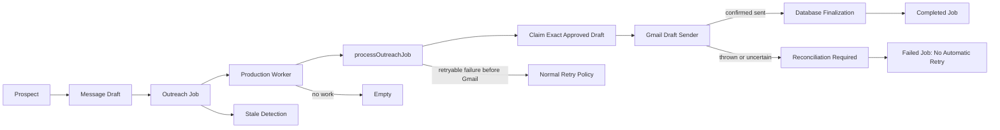
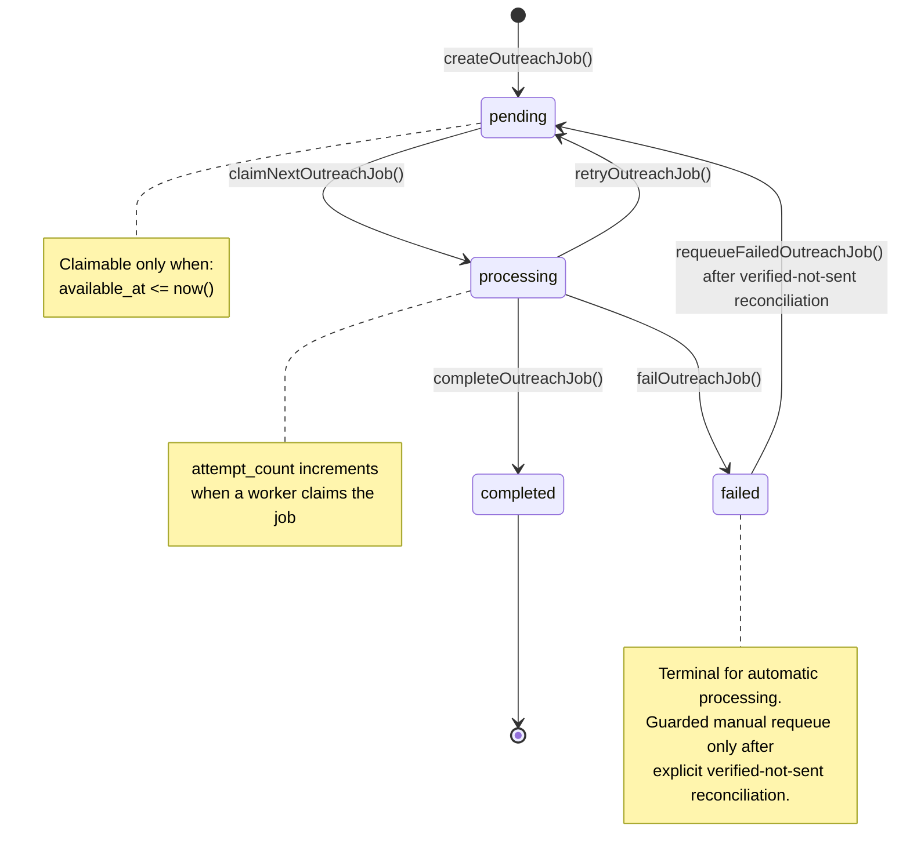
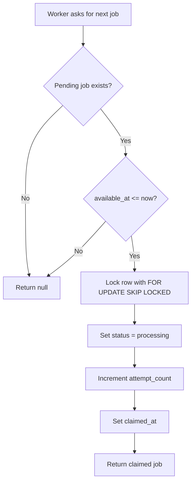
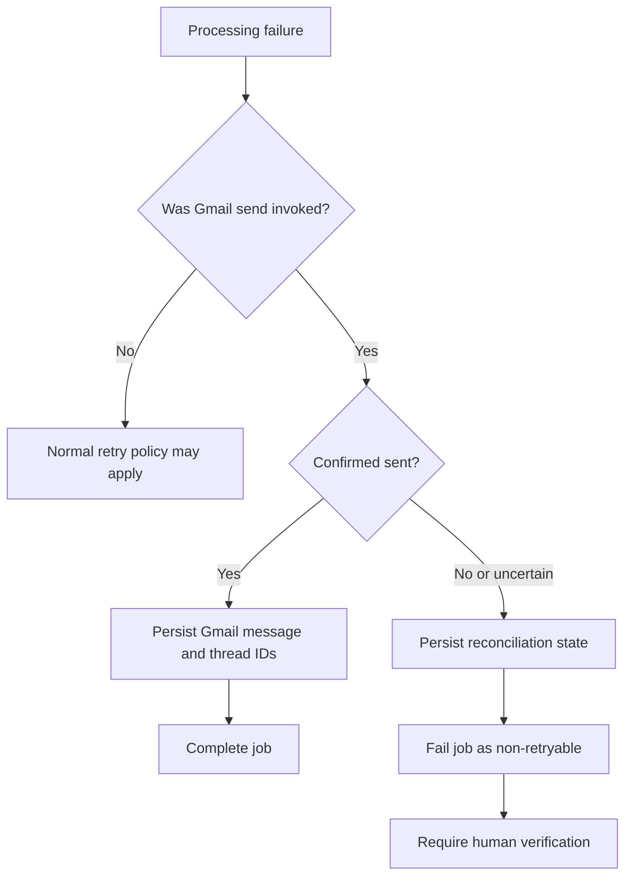
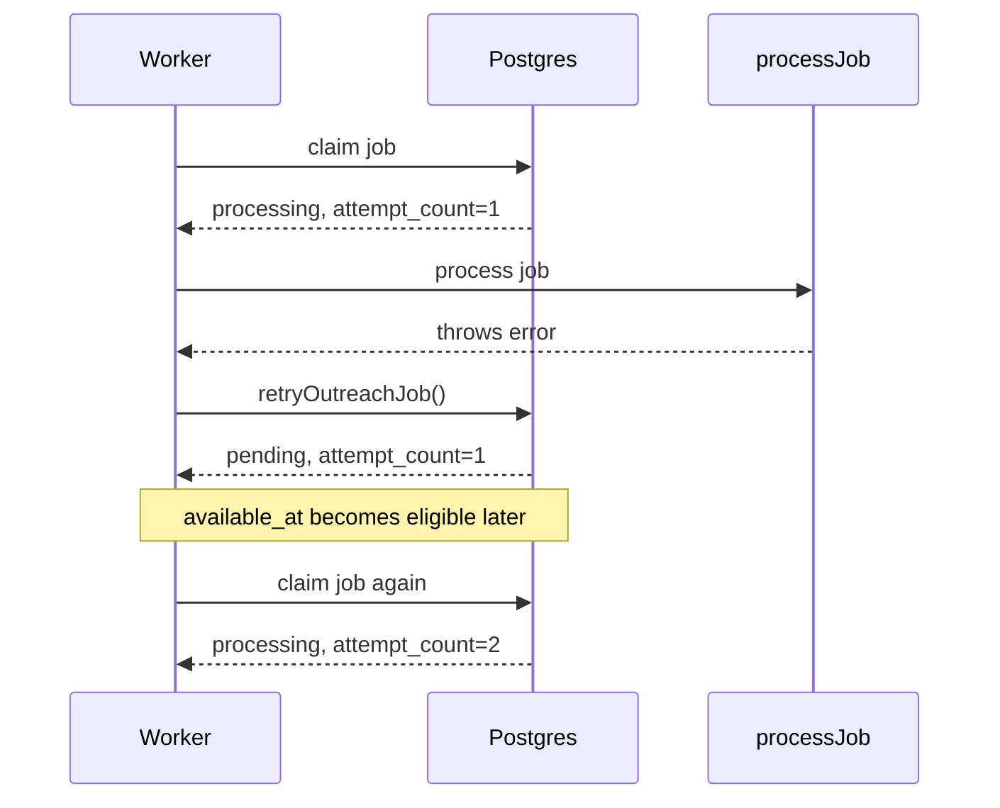
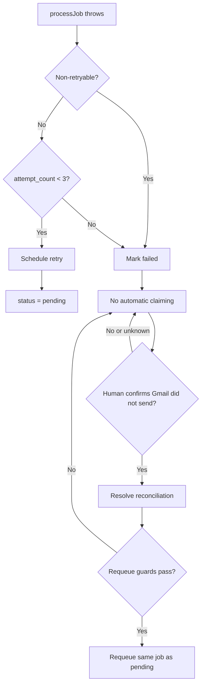
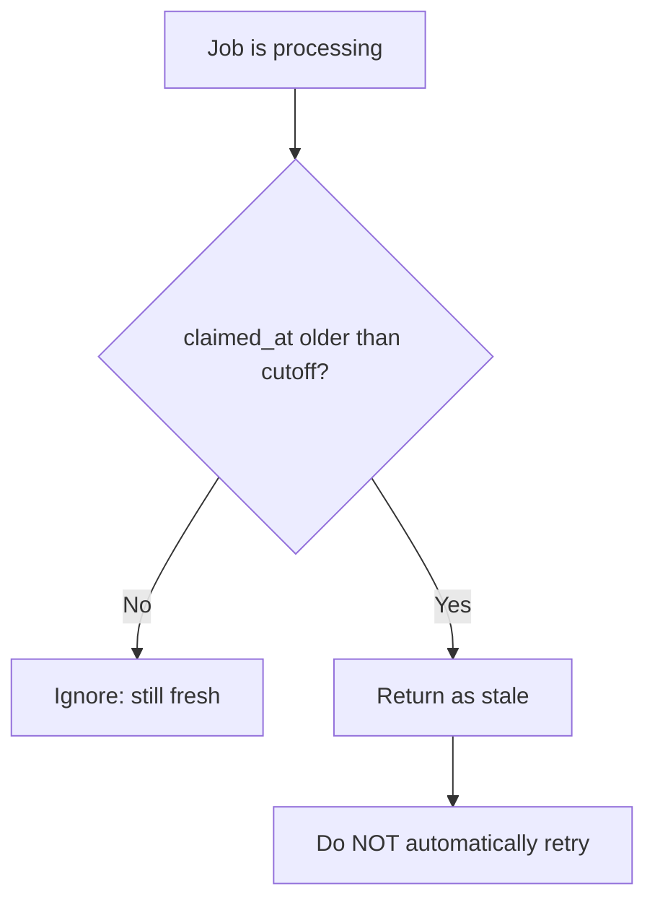
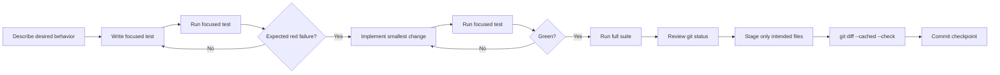

# Relay Testing & Worker Guide

**Project:** Relay
**Current test checkpoint:** 62 tests passing, 0 failing (verified October 4, 2026)
**Purpose:** Explain what the tests protect, how the queue/worker system fits together, and what to do when adding new behavior.

---

## 1. Big Picture

Relay now has three major safety layers:

1. **Outreach/business rules** protect approved drafts and sending behavior.
2. **Outreach job queue + worker rules** protect background processing, retries, failures, and concurrency.
3. **Gmail side-effect rules** distinguish safe retries from outcomes that require human reconciliation.



The production worker now connects the durable queue to Gmail. That makes the side-effect boundary the most important retry boundary in the system: failures known to occur before Gmail is invoked may use normal retry policy, but outcomes after invocation are never blindly retried.

---

## 2. Key Terms

### Prospect

The business/customer target that Relay is working with.

### Message Draft

The outreach message associated with a prospect. Existing tests protect approval, recipient matching, Gmail draft presence, completion, and reconciliation behavior.

### Outreach Job

A durable Postgres queue record tied to a message draft.

Important fields:

- `status`
- `attempt_count`
- `available_at`
- `claimed_at`
- `last_error`

### Worker

The orchestration layer that:

1. asks Postgres for the next eligible job,
2. processes it,
3. completes it, retries it, or fails it,
4. emits structured events.

The production entry point is `scripts/run-outreach-worker.ts`. It checks the explicit live-send guard before constructing the production processor or claiming work.

### `processJob`

The worker accepts a processing dependency. In production, `createProductionOutreachProcessor()` supplies a processor backed by `processOutreachJob()` and the Gmail draft sender. Tests can still inject controlled processors to prove worker behavior without calling Gmail.

The production path is:

```text
outreach job
-> production worker
-> processOutreachJob
-> claim exact approved draft
-> Gmail draft sender
-> confirmed send OR reconciliation
-> database finalization
-> confirmed send: completed job
-> reconciliation: failed job requiring human review
```

---

## 3. Outreach Job State Machine



### Legal transitions

| From         | To           |           Allowed? | Function                     |
| ------------ | ------------ | -----------------: | ---------------------------- |
| `pending`    | `processing` |                Yes | `claimNextOutreachJob()`     |
| `processing` | `completed`  |                Yes | `completeOutreachJob(jobId)` |
| `processing` | `pending`    |                Yes | `retryOutreachJob(...)`      |
| `processing` | `failed`     |                Yes | `failOutreachJob(...)`       |
| `pending`    | `completed`  |                 No | Guarded                      |
| `pending`    | `failed`     |                 No | Guarded                      |
| `completed`  | `completed`  |                 No | Guarded                      |
| `failed`     | `processing` | No automatic claim | Terminal for automatic work  |
| `failed`     | `pending`    | Guarded manual only | `requeueFailedOutreachJob()`  |

---

## 4. How Claiming Works

The queue chooses the next job. The worker does **not** pass a job ID into the claim function.

```ts
const job = await claimNextOutreachJob();
```

Conceptually:



`FOR UPDATE SKIP LOCKED` protects the queue when multiple workers race at the same time. One worker gets the row; another skips it instead of double-claiming it.

---

## 5. Retry Behavior

Failures known to occur before the Gmail side effect may use the normal retry policy unless they are classified as non-retryable business or state errors. Retryable failures are attempted up to three total times.

Current worker policy:

```text
Attempt 1 fails -> retry
Attempt 2 fails -> retry
Attempt 3 fails -> terminal failed
```

The worker uses:

```text
MAX_ATTEMPTS = 3
RETRY_DELAY_MS = 60,000
```

When a retry is scheduled:

```text
status       -> pending
last_error   -> error message
available_at -> future timestamp
claimed_at   -> null
attempt_count stays unchanged
```

`attempt_count` increases only when a job is actually claimed again.

### Gmail side-effect boundary

The normal retry policy applies to failures that occur before Gmail send has been invoked. Once the Gmail draft sender is called, Relay can no longer assume that a thrown error means nothing happened.



A thrown Gmail call, an explicit uncertain result, or a database-finalization failure after a confirmed send is non-retryable. This prevents a second automatic Gmail invocation when the first invocation may already have sent the message.

Example:



---

## 6. Terminal Failure and Guarded Manual Requeue

A job becomes automatically terminal `failed` when the worker reaches the maximum attempt count and processing fails again. A `NonRetryableOutreachJobError` also fails the job immediately, even on its first attempt, when retrying could duplicate an external side effect or violate a business guard.



A failed job is not returned by `claimNextOutreachJob()` because the claim query only looks for `status = 'pending'`.

`requeueFailedOutreachJob()` is the only guarded manual path from `failed` back to `pending`. It requires:

- the existing job to be `failed`,
- the draft to be `pending`,
- the draft to remain `approved`,
- the prospect to be `draft_ready`,
- no `sent_message_id`, and
- no `sent_at`.

The function preserves `attempt_count` and preserves `last_error` as audit history. It updates the existing job rather than inserting a replacement.

`outreach_jobs.draft_id` is unique. One draft therefore has one queue job; after verified-not-sent reconciliation, Relay requeues that same failed job instead of creating a second job for the same draft.

### Resolving a confirmed non-send

`resolveOutreachReconciliationAsNotSent(prospectId, draftId)` is a human-authorized recovery operation. It must be used only after a person has confirmed that Gmail did not send the message.

It performs these state transitions in one database transaction:

```text
message_drafts.send_status:
needs_reconciliation -> pending

prospects.stage:
send_reconciliation -> draft_ready
```

It rejects records that are not in both reconciliation states, and it rejects any draft with `sent_message_id` or `sent_at` evidence. It clears the reconciliation error and timestamp but leaves approval intact. After that explicit resolution, `requeueFailedOutreachJob()` may return the existing failed job to `pending` only if all of its own guards also pass.

---

## 7. Stale Job Detection

A worker can crash after claiming a job and leave it stuck in `processing`.

Relay now detects this without automatically retrying it.



This separation is deliberate.

A stale job could mean:

```text
Safe-looking case:
worker claimed job -> crashed before doing anything

Dangerous case:
worker claimed job -> external action succeeded -> worker crashed
```

Because Gmail is connected, blindly retrying the second case could send a duplicate message.

So:

**Detect stale jobs: yes.**
**Blindly requeue stale jobs: no.**

---

## 8. Worker Flow

```mermaid
flowchart TD
    A[runOutreachWorkerOnce] --> B[claimNextOutreachJob]
    B --> C{Job found?}

    C -->|No| E[Emit empty event]
    E --> N[Return null]

    C -->|Yes| CL[Emit claimed event]
    CL --> P[processJob(job)]

    P -->|Success| CO[completeOutreachJob]
    CO --> CE[Emit completed event]
    CE --> CR[Return completed job]

    P -->|Throws| NR{Non-retryable?}

    NR -->|Yes| F[failOutreachJob]
    NR -->|No| Q{attempt_count < 3?}

    Q -->|Yes| R[retryOutreachJob]
    R --> RE[Emit retry_scheduled event]
    RE --> RR[Return pending job]

    Q -->|No| F
    F --> FE[Emit failed event]
    FE --> FR[Return failed job]
```

In the production processor, a Gmail call that throws or returns an uncertain outcome is converted into a non-retryable failure after reconciliation state is persisted. The worker therefore marks the job failed on that attempt instead of scheduling another Gmail send.

---

## 9. Worker Event Logging

The worker currently emits structured events instead of relying only on arbitrary `console.log()` statements.

Current event types:

```text
empty
claimed
completed
retry_scheduled
failed
```

Examples:

```ts
{
  type: "claimed",
  jobId: "...",
  attemptCount: 1
}
```

```ts
{
  type: "retry_scheduled",
  jobId: "...",
  attemptCount: 1,
  error: "Temporary processing failure",
  retryAt: ...
}
```

```ts
{
  type: "failed",
  jobId: "...",
  attemptCount: 3,
  error: "Third failure"
}
```

The worker emits state-change events **after** the corresponding database update succeeds. This prevents logging a transition that never actually happened.

---

# 10. Test Catalog

The suite currently contains **62 tests**, with **62 passing and 0 failing** at the verified checkpoint.

## A. Gmail Integration and Outreach Safety Tests

| Test file                                   | Test                                                                                                     | What it protects                                                                       |
| ------------------------------------------- | -------------------------------------------------------------------------------------------------------- | -------------------------------------------------------------------------------------- |
| `gmail-api-client.test.ts`                  | Gmail auth: creates Gmail API compatible with draft sender                                               | Production auth wiring supplies the API shape required by the sender.                  |
| `gmail-auth-missing-refresh-token.test.ts`  | Gmail auth: rejects missing refresh token                                                                | Production Gmail setup fails closed when credentials are incomplete.                   |
| `gmail-auth.test.ts`                        | Gmail auth: loads complete OAuth credentials                                                             | Required OAuth configuration is loaded into the runtime boundary.                      |
| `gmail-draft-sender-incomplete-response.test.ts` | Gmail draft sender: rejects an incomplete Gmail response                                            | Missing confirmed message evidence is never treated as a successful send.              |
| `gmail-draft-sender.test.ts`                | Gmail draft sender: sends the exact Gmail draft and returns message IDs                                  | The sender uses the claimed Gmail draft and returns finalization evidence.              |
| `gmail-oauth-client.test.ts`                | Gmail auth: configures OAuth client with refresh token                                                    | OAuth refresh credentials are installed on the Gmail client.                           |
| `gmail-reconciliation.test.ts`              | Gmail reconciliation: marks an uncertain Gmail send for reconciliation                                   | An uncertain send is routed to reconciliation instead of treated as confirmed success. |
| `gmail-runtime.test.ts`                     | Gmail runtime: creates a production draft sender from environment credentials                            | The production processor can construct the real Gmail sender.                          |
| `gmail-success.test.ts`                     | Gmail success: marks the draft sent after a confirmed Gmail send                                         | A confirmed Gmail send moves the draft into its successful sent state.                 |
| `invalid-prospect-stage.test.ts`            | Invalid prospect stage: rejects an outreach draft when the prospect is not draft_ready                   | Outreach cannot proceed from an invalid prospect stage.                                |
| `message-draft-by-id-missing.test.ts`       | Message draft lookup: returns null when the draft ID does not exist                                       | Job processing fails closed when its referenced draft is missing.                      |
| `message-draft-by-id.test.ts`               | Message draft lookup: returns the exact draft by ID                                                       | A queue job resolves its specific draft instead of selecting another draft.             |
| `outreach-already-sent.test.ts`             | Outreach already sent: rejects a draft because it was already sent                                       | Prevents repeat sending after completion.                                              |
| `outreach-claim-validation.test.ts`         | Outreach claim validation: rejects an unapproved outreach draft                                          | Only an approved draft can be claimed for outreach.                                    |
| `outreach-completion-guard.test.ts`         | Outreach completion guard: rejects completion when the draft is still pending                            | Prevents skipping the required send/processing state.                                  |
| `outreach-concurrent-claim.test.ts`         | Outreach concurrent claim: allows only one worker to claim the same draft concurrently                   | Prevents two callers from claiming the same outreach draft.                            |
| `outreach-duplicate-completion.test.ts`     | Outreach duplicate completion: rejects duplicate completion after the draft is already sent              | Prevents a completed send from being completed again.                                  |
| `outreach-duplicate-reconciliation.test.ts` | Outreach duplicate reconciliation: rejects duplicate reconciliation without mutating the original record | Prevents duplicate reconciliation operations.                                          |
| `outreach-missing-gmail-draft.test.ts`      | Outreach missing Gmail draft: rejects an outreach draft without a Gmail draft ID                         | Prevents sending when Gmail draft identity is missing.                                 |
| `outreach-recipient-mismatch.test.ts`       | Outreach recipient mismatch: rejects an outreach draft with a mismatched recipient                       | Prevents sending to an unexpected recipient.                                           |
| `outreach-reconciliation-guard.test.ts`     | Outreach reconciliation guard: rejects reconciliation when the draft is still pending                    | Reconciliation cannot be applied from the wrong state.                                 |
| `outreach-reconciliation-not-sent.test.ts`  | Outreach reconciliation: confirmed not sent returns draft to pending                                     | Human-verified non-send can safely restore `pending` and `draft_ready`.                 |
| `outreach-reconciliation-rejects-pending.test.ts` | Outreach reconciliation: rejects a draft that is not awaiting reconciliation                       | The resolver cannot reset an ordinary pending draft.                                   |
| `outreach-wrong-prospect.test.ts`           | Outreach wrong prospect: rejects an outreach draft when it belongs to a different prospect               | Prevents cross-prospect draft misuse.                                                  |

## B. Outreach Job Queue Tests

| Test file                                   | Test                                                                                    | What it protects                                                   |
| ------------------------------------------- | --------------------------------------------------------------------------------------- | ------------------------------------------------------------------ |
| `outreach-job-creation.test.ts`             | Outreach job creation: creates a pending outreach job for a draft                       | New jobs start correctly in `pending`.                             |
| `outreach-job-claim.test.ts`                | Outreach job claim: claims the next pending outreach job                                | An eligible pending job becomes `processing`.                      |
| `outreach-job-empty-claim.test.ts`          | Outreach job empty claim: returns null when no pending job is available                 | Empty queues are handled normally.                                 |
| `outreach-job-concurrent-claim.test.ts`     | Outreach job concurrent claim: allows only one worker to claim a pending job            | Prevents queue double-claiming.                                    |
| `outreach-job-completion.test.ts`           | Outreach job completion: marks a processing job completed                               | Valid `processing -> completed` transition works.                  |
| `outreach-job-completion-guard.test.ts`     | Outreach job completion guard: rejects completion when the job is still pending         | Prevents `pending -> completed`.                                   |
| `outreach-job-duplicate-completion.test.ts` | Outreach job duplicate completion: rejects completion when the job is already completed | Prevents repeated completion.                                      |
| `outreach-job-retry.test.ts`                | Outreach job retry: returns a processing job to pending for a later attempt             | Retry state is stored correctly.                                   |
| `outreach-job-retry-delay.test.ts`          | Outreach job retry delay: does not claim a retry before it is available                 | Future `available_at` actually delays claiming.                    |
| `outreach-job-retry-claim.test.ts`          | Outreach job retry claim: claims an eligible retry as a second attempt                  | Eligible retries return to processing and increment attempt count. |
| `outreach-job-failure.test.ts`              | Outreach job failure: marks a processing job failed                                     | Valid terminal failure works.                                      |
| `outreach-job-failure-guard.test.ts`        | Outreach job failure guard: rejects failure when the job is still pending               | Prevents `pending -> failed`.                                      |
| `outreach-job-failed-claim.test.ts`         | Outreach job failed claim: does not claim a terminally failed job                       | Failed jobs stay out of the queue.                                 |
| `outreach-job-requeue.test.ts`              | Outreach job requeue: safely requeues a failed send-ready job                           | Verified-safe manual recovery reuses the failed job without erasing audit state. |
| `outreach-job-requeue-rejects-reconciliation.test.ts` | Outreach job requeue: rejects a draft still awaiting reconciliation          | An ambiguous Gmail outcome cannot be blindly returned to the queue. |
| `outreach-job-stale-detection.test.ts`      | Outreach job stale detection: finds a processing job claimed before the cutoff          | Old abandoned processing jobs can be detected.                     |
| `outreach-job-fresh-detection.test.ts`      | Outreach job stale detection: ignores a recently claimed processing job                 | Fresh processing work is not falsely labeled stale.                |

## C. Production Outreach Processor Tests

| Test file                                               | Test                                                                                | What it protects                                                        |
| ------------------------------------------------------- | ----------------------------------------------------------------------------------- | ----------------------------------------------------------------------- |
| `process-outreach-job-claim.test.ts`                    | Outreach job processing: claims the exact referenced draft                         | The processor sends only the draft named by the claimed queue job.      |
| `process-outreach-job-finalization-throws.test.ts`      | Outreach job processing: finalization failure after confirmed send is non-retryable | A confirmed Gmail side effect is never repeated after a database error. |
| `process-outreach-job-rejected-claim.test.ts`           | Outreach job processing: rejected claim is non-retryable                           | Business-rule rejection cannot enter a retry loop.                      |
| `process-outreach-job-sender-throws.test.ts`            | Outreach job processing: thrown Gmail sender error requires reconciliation          | A thrown Gmail outcome fails closed instead of retrying.                |
| `process-outreach-job-uncertain.test.ts`                | Outreach job processing: uncertain Gmail result requires reconciliation             | Explicit uncertainty persists reconciliation state.                     |
| `resolve-outreach-job-draft-missing.test.ts`            | Outreach job draft resolution: missing draft is non-retryable                       | Missing durable state fails immediately.                               |
| `resolve-outreach-job-draft.test.ts`                    | Outreach job draft resolution: returns the draft referenced by the job              | Draft lookup follows the job's exact `draft_id`.                        |

## D. Worker Behavior and Runtime Tests

| Test file                         | Test                                                                      | What it protects                                         |
| --------------------------------- | ------------------------------------------------------------------------- | -------------------------------------------------------- |
| `outreach-worker-success.test.ts` | Outreach worker success: processes and completes the next job             | Worker coordinates claim -> processing -> completion.    |
| `outreach-worker-empty.test.ts`   | Outreach worker empty queue: returns null without processing a job        | Worker safely handles no work.                           |
| `outreach-worker-retry.test.ts`   | Outreach worker retry: schedules a failed first attempt for retry         | Ordinary early failures go back to pending with a delay. |
| `outreach-worker-failure.test.ts` | Outreach worker failure: marks the third failed attempt terminally failed | Worker stops retrying after max attempts.                |
| `outreach-worker-non-retryable.test.ts` | Outreach worker non-retryable failure: fails on the first attempt   | Side-effect-sensitive failures bypass automatic retry.   |
| `outreach-worker-processor-success.test.ts` | Outreach worker integration: completes a job after a confirmed send | The worker and production processor complete the durable job together. |
| `outreach-worker-processor-uncertain.test.ts` | Outreach worker integration: uncertain send fails without retry   | Gmail uncertainty becomes a failed job requiring reconciliation. |
| `outreach-worker-runtime.test.ts` | Outreach worker runtime: creates a production processor                    | Runtime wiring connects worker processing to Gmail.      |
| `live-outreach-send-guard.test.ts` | Live outreach guard: rejects when live sending is not explicitly enabled   | Production sending defaults to disabled.                 |
| `live-outreach-send-guard-enabled.test.ts` | Live outreach guard: allows live sending when explicitly enabled | The explicit production gate has one auditable opt-in value. |

## E. Worker Logging Tests

| Test file                                 | Test                                                                           | What it protects                                 |
| ----------------------------------------- | ------------------------------------------------------------------------------ | ------------------------------------------------ |
| `outreach-worker-logging.test.ts`         | Outreach worker logging: records claim and completion events                   | Successful runs emit `claimed` and `completed`.  |
| `outreach-worker-retry-logging.test.ts`   | Outreach worker logging: records a scheduled retry after processing fails      | Retry runs emit `claimed` and `retry_scheduled`. |
| `outreach-worker-failure-logging.test.ts` | Outreach worker logging: records a terminal failure after the final attempt    | Terminal failure emits `claimed` and `failed`.   |
| `outreach-worker-empty-logging.test.ts`   | Outreach worker logging: records an empty queue event when no job is available | Empty worker runs are visible.                   |

---

# 11. Why There Are Two Different "Claim" Test Groups

This is easy to confuse.

## Outreach draft claim

Examples:

- `outreach-claim-validation.test.ts`
- `outreach-concurrent-claim.test.ts`

These protect the **business/send layer** around a message draft.

## Outreach job claim

Examples:

- `outreach-job-claim.test.ts`
- `outreach-job-concurrent-claim.test.ts`

These protect the **background queue layer**.

Think of it this way:

```text
Message Draft
    |
    | business/send safety
    v
Outreach Job
    |
    | queue/worker safety
    v
Worker
```

They solve related but different concurrency problems.

---

# 12. How to Interpret Negative Tests

A negative test can pass even though an application operation fails.

Example:

```ts
await assert.rejects(
  () => completeOutreachJob(job.id),
  /Outreach job is not processing/,
);
```

Meaning:

```text
Illegal application action: rejected
Test expectation: satisfied
Test result: PASS
```

So:

```text
application action failed = sometimes correct
test failed = test expectation was not met
```

Relay intentionally has many negative tests because it is designed to **fail closed** when state is unsafe or ambiguous.

---

# 13. Testing Procedure

When adding new Relay behavior, use this workflow.



### Focused development test

```bash
npx tsx --test tests/<domain>/<specific-test>.test.ts
```

### Full suite

```bash
npm test
```

Current healthy result:

```text
tests 62
pass 62
fail 0
```

### Before committing

```bash
git status --short
git add <only intended files>
git diff --cached --check
git commit -m "..."
```

Avoid blindly staging everything with:

```bash
git add .
```

when you can stage the intended files explicitly.

---

# 14. Red -> Green -> Refactor

The test-driven cycle used throughout this phase:

```text
RED
Write a test for behavior that does not exist yet.
Confirm it fails for the reason you expected.

GREEN
Implement the smallest production change that makes it pass.

REFACTOR
Clean up structure without changing behavior.
Run the tests again.
```

A red test is useful only if it actually exercises the behavior you intended.

Example learned during worker development:

- Importing `runOutreachWorkerOnce()` was not enough.
- Until the test actually called it, the test passed even though the worker still threw `"Not implemented"`.
- Once the test invoked the worker, the intended red failure appeared.

---

# 15. Current Safety Rules Worth Remembering

1. **Postgres is authoritative durable state.**
2. **Only pending jobs with `available_at <= now()` can be claimed.**
3. **Concurrent workers must not double-claim the same job.**
4. **`attempt_count` means processing attempts started.**
5. **Retryable pre-Gmail failures return to `pending`; exhausted or non-retryable failures become `failed`.**
6. **A failed job is not automatically reprocessed. Guarded manual requeue requires verified-safe state.**
7. **A stale processing job is detected, not blindly retried.**
8. **Completion/failure functions only accept a job in `processing`.**
9. **Logs/events should describe database transitions only after those transitions succeed.**
10. **Once Gmail send is invoked, thrown or uncertain outcomes are non-retryable and require reconciliation.**
11. **Only a human-confirmed non-send may move `needs_reconciliation -> pending` and `send_reconciliation -> draft_ready`.**
12. **Manual requeue preserves `attempt_count` and `last_error`; audit history is not reset.**
13. **Because `outreach_jobs.draft_id` is unique, recovery requeues the existing job instead of inserting another one.**

---

# 16. What Is Complete vs. What Comes Next

## Production outreach path: complete and covered

- Job creation
- Safe claiming
- Concurrent claim protection
- Empty queue handling
- Completion
- Completion guards
- Retry state
- Retry timing
- Multiple attempts
- Terminal failure
- Failure guards
- Stale detection
- Worker orchestration
- Worker event logging
- Exact draft resolution from `outreach_jobs.draft_id`
- Approved outreach-draft claim and validation
- Production Gmail OAuth/runtime wiring
- Gmail draft sending
- Confirmed-send database finalization
- Non-retryable handling after Gmail invocation
- Reconciliation for thrown or uncertain Gmail outcomes
- Human-confirmed not-sent resolution
- Guarded manual requeue of the existing failed job
- Explicit live-send enablement guard

Connecting Gmail to `processJob` is complete. The production worker now constructs the Gmail draft sender and executes `processOutreachJob()` for the claimed queue job.

The governing rule is:

```text
Known failure before Gmail is invoked
    -> normal retry policy may be safe

Confirmed Gmail send
    -> persist message evidence
    -> complete the job

Thrown or uncertain outcome after Gmail is invoked
    -> persist reconciliation state
    -> fail the job without automatic retry
    -> require human verification
```

## Production-validation milestone

A controlled end-to-end Gmail test was successfully completed through the production worker. The first attempt encountered a Gmail API configuration failure. Relay failed closed into reconciliation without retrying. A human confirmed that the message was not sent, the record was explicitly reconciled, and the same failed job was safely requeued. The second attempt sent successfully, Gmail's returned message ID was persisted in Postgres, and the job completed.

This milestone verifies the intended recovery path without changing the rule that ambiguous Gmail outcomes must never be retried automatically.

## What comes next

Future work is operational rather than connecting the core Gmail path: production scheduling, monitoring, alerting, reconciliation runbooks, and additional guarded recovery tooling should build on the current fail-closed behavior. None of those additions should weaken the live-send gate, reconciliation requirement, or no-blind-retry boundary.

---

# 17. Quick Reference

```text
createOutreachJob(draftId)
    -> pending

claimNextOutreachJob()
    -> processing
    -> attempt_count + 1

completeOutreachJob(jobId)
    processing -> completed

retryOutreachJob(jobId, error, retryAt)
    processing -> pending

failOutreachJob(jobId, error)
    processing -> failed

findStaleOutreachJobs(cutoff)
    -> read-only detection of old processing jobs

processOutreachJob(job, sendDraft)
    -> resolve exact job draft
    -> claim approved outreach draft
    -> invoke Gmail draft sender
    -> persist confirmed send or reconciliation

runOutreachWorkerOnce(processJob, logger?)
    -> null / completed / pending retry / failed

resolveOutreachReconciliationAsNotSent(prospectId, draftId)
    needs_reconciliation -> pending
    send_reconciliation -> draft_ready
    -> only after human confirmation that Gmail did not send

requeueFailedOutreachJob(jobId)
    failed -> pending
    -> guarded manual recovery of the existing unique job
    -> preserves attempt_count and last_error
```

### Worker outcomes

```text
No job:
empty event -> null

Success:
claimed -> completed

Retryable attempt:
claimed -> retry_scheduled

Final failed attempt:
claimed -> failed

Non-retryable Gmail/guard outcome:
claimed -> failed on the current attempt

Verified-not-sent manual recovery:
reconciliation resolved -> same failed job requeued
```

---

## Recommended mental model

If the number of tests starts feeling overwhelming, do not memorize all 62.

Remember the layers:

```text
1. Draft safety
2. Queue state machine
3. Worker orchestration
4. Durability / stale detection
5. Observability
6. Gmail reconciliation safety
7. Guarded manual recovery
```

Every test belongs to one of those buckets.
